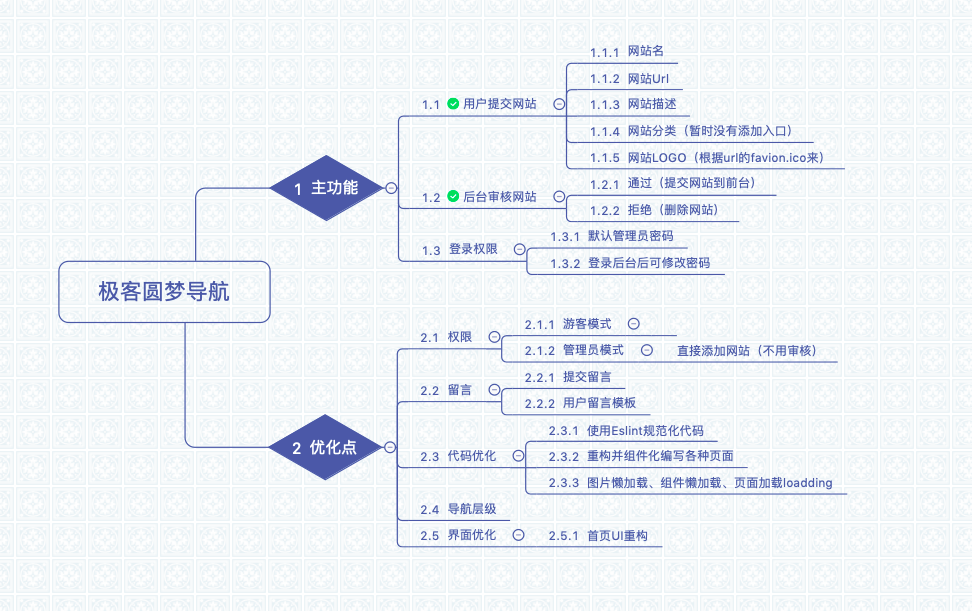
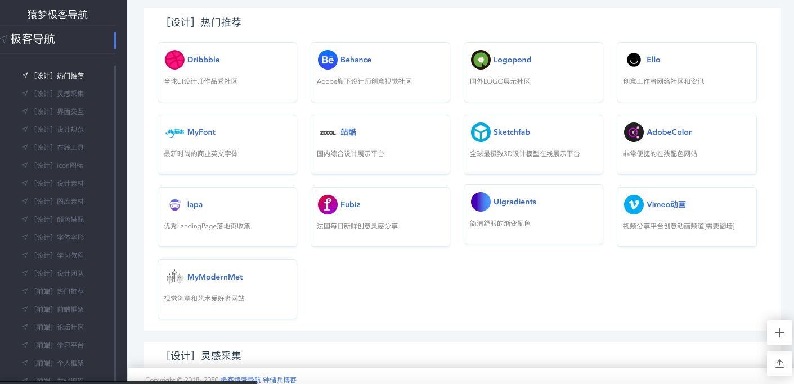
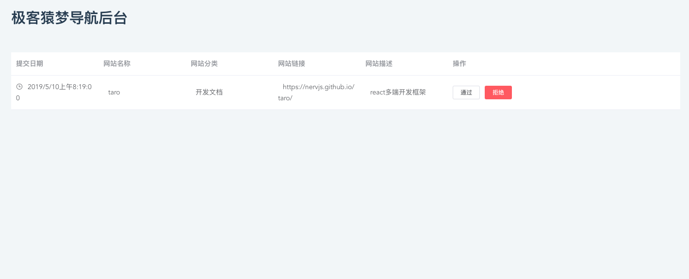
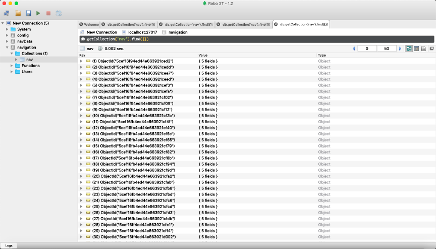

# geek-navigation 2.0

猿梦极客导航，致力于方便程序员寻找各种网络资源。

## 功能导图


## 提示
[静态导航版](https://github.com/geekape/geek-navigation/tree/master)

[后台地址](http://navigate.ym1024.com/admin)

导航还有不少问题，欢迎各位朋友反馈，在[issues](https://github.com/geekape/geek-navigation/issues)提出，我会尽快解决。

## 效果图




## 使用

### 1. 修改后台登录密码
打开根目录下的`server/router.js`文件，修改密钥**secret**的值。

### 2. 本地mongodb没导航数据？
运行爬虫文件`node reptile/index.js`,确保你已经开启了本地Mongodb数据库，就可以爬导航到本地的数据库了


```js
// 1. 下载代码
git clone git@github.com:geekape/geek-navigation.git

// 2. 本地安装包
npm i 或者 cnpm i

// 3.假设已启动mongodb，启动本地服务器
node server/app.js

// 4. 运行项目
npm run serve

// 5. 预览项目
http://localhost:8080
```
> 


