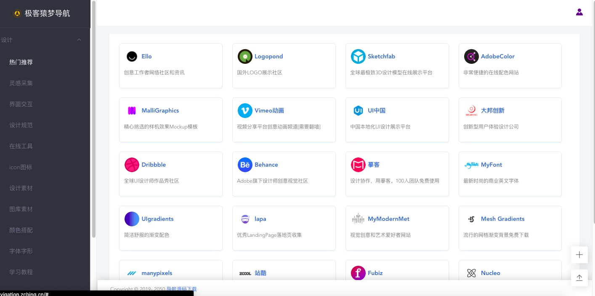
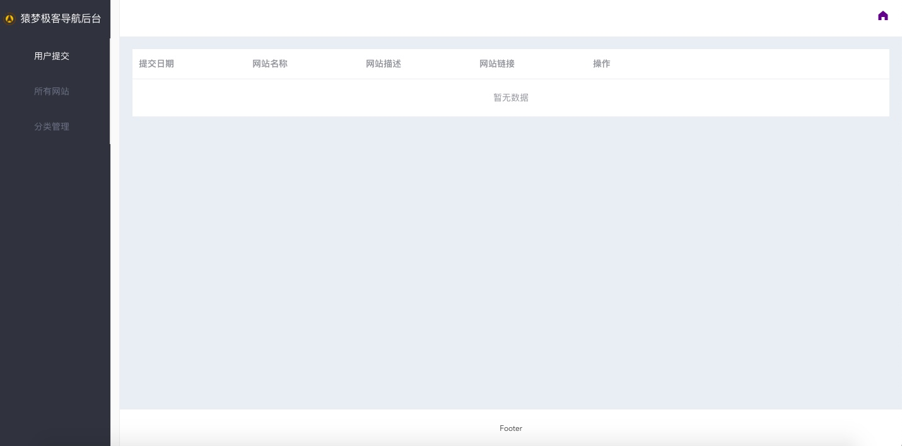
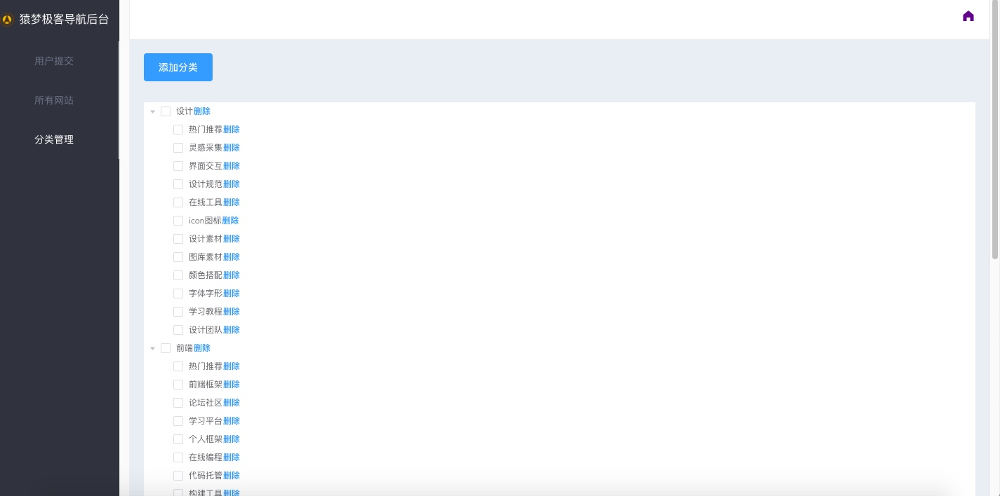

#  极客猿梦导航

> 面向独立开发者的导航站

## 简介
极客猿梦导航，致力于方便独立开发者/程序员寻找各种网络资源。

以前，我有很多导航资源，我都把它们收集在浏览器收藏夹中，可到一定量后，我发现想找一些网站不容易，因为当时添加它也没有做明确的备注，现在我将导航添加到**极客猿梦导航站**中，每个网站都包含一些子信息，尽管你不添加，还是会比收藏夹里面的更好找一点。

## V1.0版本

- [老版本纯静态导航版](https://github.com/geekape/geek-navigation/tree/master)：最初的一版静态页面，数据都写在页面里的。

- [JSON静态导航版](https://github.com/geekape/geek-navigation/tree/json-navigation)：数据和页面分享，可以部署在`github`或`gitee`上使用，将dist目录下的文件上传到远程仓库里访问。

- [数据库动态导航版](https://github.com/geekape/geek-navigation/tree/vue2)：功能最全的版本，后续会增加更多功能

## v2.0
- vue全家桶
- elementUI

⚠️ 用户提交网站，只需要填写网站url和分类，提交后爬虫会补信息，如logo，标题和描述。

### TODO
- [ ] mongoose联表优化
- [x] 首页加keep-live
- [ ] 增加喜欢和浏览量
- [ ] 增加提交作者名，信息
- [ ] 增加搜索
- [ ] 分页等接口优化
- [ ] 审核列表状态切换
- [ ] 提交排除重复网站
- [ ] 自动化部署
- [x] 一键拒绝审核列表
- [x] 后台网站编辑更新
- [x] 爬虫爬取失败手动填写
- [x] 验证url
- [x] websitelist
- [x] 审核网站爬虫自动补全信息
- [x] 用户登录，默认第一次登录账号为管理员









## 友情提示

- 如果你对这个项目有兴趣，可点`star`保持关注，当然，你也可以`Fork`代码，自己完善这个项目，你愿意的话可以`pull`到我仓库来合并。

- 你如果遇到什么困难或bug，随时可以在[issues](https://github.com/geekape/geek-navigation/issues)提出，我会尽快解决。


## 常见问题
- [已解决的问题列表](https://github.com/geekape/geek-navigation/issues?q=is%3Aissue+is%3Aclosed)

### 1. 什么是数据库版？什么是静态JSON版本？
为了方便无需配置数据库的小白，提供了静态[JSON版本的导航](https://github.com/geekape/geek-navigation/tree/json-navigation)，静态版本只能本地修改JSON添加导航，没有管理后台。

而相对于静态版的××数据库版本**，它提供了管理导航的界面，用户可在线提交网站，后台审核，并管理所有网站（推荐）


### 2. 本地mongodb没导航数据？
运行爬虫文件`node reptile.js`,确保你已经开启了本地Mongodb数据库，就可以爬导航到本地的数据库了

### 3. 本地运行
```js
// 1. 下载代码
git clone git@github.com:geekape/geek-navigation.git

// 2. 本地安装包
npm i 或者 cnpm i

// 3.假设已启动mongodb，启动本地服务器
node server/app.js

// 4. 运行项目
npm run serve

// 5. 预览项目
http://localhost:8080
```


